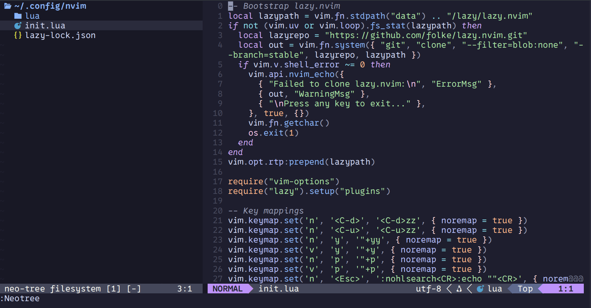

# 🖼️ Neovim Setup Preview

# 🛠️ Neovim Setup Inspired by TypeCraft

This is my personal Neovim configuration, inspired by the amazing [TypeCraft YouTube tutorials](https://www.youtube.com/@typecraft_dev). It's a clean, beginner-friendly setup tailored for an efficient and visually pleasing development experience.

---

## ✨ Features

This setup includes a curated list of plugins that enhance productivity and aesthetics:

- 🎨 **Catppuccin** – Beautiful, soothing color scheme  
- 📊 **Lualine** – A fast and customizable status line  
- 🗂️ **Neo-tree** – Modern file explorer with icons and git support  
- 🔍 **Telescope** – Fuzzy finder for files, buffers, and more  
- 🌲 **Treesitter** – Better syntax highlighting and code parsing  

---

## 📦 Installation

To get started, run the following commands:

    git clone https://github.com/devbyte1328/nvim-setup.git
    cd nvim-setup/
    cp -r nvim/ ~/.config/

> ⚠️ **Note:** If you already have a Neovim config in `~/.config/nvim`, make sure to back it up before copying.

---

## 🧰 Requirements

Make sure you have the following installed:

- [Neovim (v0.9+ recommended)](https://neovim.io/)
- Git
- A Nerd Font (e.g., FiraCode Nerd Font) for icons
- Optional: `ripgrep` (for Telescope live grep)

---

## 📁 Plugin Overview

| Plugin         | Description                                   |
|----------------|-----------------------------------------------|
| `catppuccin`   | Theme for beautiful and cohesive colors       |
| `lualine`      | Customizable and minimal statusline           |
| `neo-tree`     | Lua-powered file explorer                     |
| `telescope`    | Fuzzy finder for files, buffers, etc.         |
| `treesitter`   | Syntax-aware code highlighting and folding    |

---

## 🙏 Credits

Big thanks to [TypeCraft](https://www.youtube.com/@typecraft_dev) for the tutorials that guided this setup.

---

## 📬 Contact

Feel free to fork, star, or open issues if you find bugs or have suggestions!
